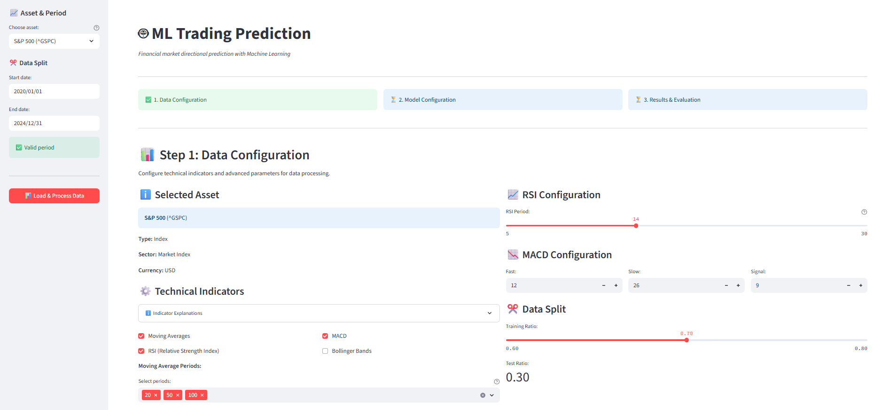

# ML Trading Prediction

A small ML project that tries to predict next-day market direction (up or down) from
price history and technical indicators, and checks whether that prediction is actually
better than doing something trivial. Random Forest and an MLP are trained on OHLCV data
and compared against six naive baselines (always up, always down, random, historical
frequency, momentum, mean reversion). There's a Streamlit app to run the whole thing
interactively, and a CLI for quick checks.

Built as a portfolio project — it's intentionally scoped to a straightforward binary
classification setup rather than a full backtesting/trading system.



## What it does

1. Pulls OHLCV data for an asset from Yahoo Finance.
2. Computes ~40 features: moving averages, RSI, MACD, Bollinger Bands, ATR, momentum,
   and basic price-ratio features.
3. Labels each day with whether the *next* day closed higher (binary target).
4. Splits the data chronologically (no shuffling — this is a time series).
5. Trains Random Forest and/or MLP classifiers, and evaluates the naive strategies.
6. Reports accuracy, precision, recall, F1, and a confusion matrix, and compares
   everything against the baselines.

The point of the naive baselines is to answer a basic question before trusting any
model: is it actually learning something, or just riding a market that goes up most
of the time?

## Quick start

```bash
git clone https://github.com/yaaks7/ml-trading.git
cd ml-trading

python -m venv .venv
source .venv/bin/activate  # Windows: .venv\Scripts\activate

pip install -r requirements.txt
```

**Streamlit app** (the main way to use this):

```bash
streamlit run streamlit_app/app.py
```

Opens at [localhost:8501](http://localhost:8501). Walks through data configuration →
model configuration → results, in three steps.

**CLI** (quick benchmark run, no ML models — see below):

```bash
python main.py --asset BTC-USD --start-date 2023-01-01 --end-date 2024-12-31
python main.py --test   # synthetic data, no network needed
```

Note: `main.py` currently only runs the naive strategies, not the ML models — the
Streamlit app is where Random Forest and MLP actually get trained.

## Project layout

```
config/            asset registry, data/model config dataclasses
src/data/          Yahoo Finance fetching + feature engineering
src/models/        Random Forest and MLP wrappers around scikit-learn
src/strategies/    the six naive baseline strategies
streamlit_app/      the interactive app
main.py            CLI entry point (baselines only)
tests/             pytest suite
docs/              notes on the models and baselines
```

## Models and baselines

**ML models:** Random Forest, MLP (both scikit-learn, configurable via the app's
sidebar). See [docs/ML_MODELS.md](docs/ML_MODELS.md).

**Naive baselines:** Bullish (always up), Bearish (always down), Random (50/50),
Frequency (historical up-rate), Momentum (repeats last direction), Mean Reversion
(opposite of last direction). See [docs/BENCHMARK_STRATEGIES.md](docs/BENCHMARK_STRATEGIES.md).

## Supported assets

Indices (S&P 500, NASDAQ, Dow Jones), a handful of large-cap tech/auto stocks (AAPL,
MSFT, GOOGL, TSLA, NVDA, META, AMZN), crypto (BTC, ETH, SOL), and two commodity futures
(gold, crude oil). See `SUPPORTED_ASSETS` in [config/settings.py](config/settings.py)
to add more — any Yahoo Finance ticker works.

## Evaluation metrics

Accuracy, precision, recall, F1, and confusion matrix — this is a binary classifier,
not a backtested trading strategy, so there's no P&L, Sharpe ratio, or drawdown here.
The app also reports the train/test accuracy gap as a rough overfitting check.

## Tech stack

Python, pandas/numpy, scikit-learn, yfinance, plotly, streamlit, joblib.

## Tests

```bash
pytest tests/
```

## License

MIT — see [LICENSE](LICENSE).

## Author

Yanis Aksas — [github.com/yaaks7](https://github.com/yaaks7) · [linkedin.com/in/yanisaks](https://linkedin.com/in/yanisaks) · yanis.aksas@gmail.com
